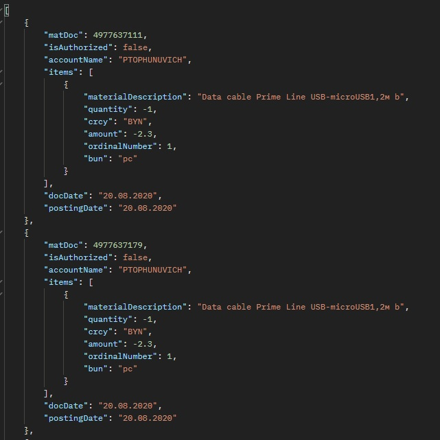
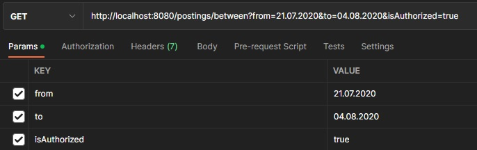

# Краткое описание

[Ссылка на файл с заданием](src/main/resources/tasks.txt)\
Где возможно тестирование производилось через библиотеку JUnit
- Параметры для работы с БД задаются в application.properties файле
- необходимо создать базу данных "a1" в PostgreSQL и запустить проект из класса Main, все необходимые таблицы будут созданы автоматически 

## Задание 1

В языке Java нет в явном виде беззнаковых примитивных типов данных
(существуют классы обертки, в которых есть методы для получения беззнаковых чисел, в лучшем случае при использовании примитивных типов данных мы получим отрицательное число), задание было выполнено обходным путем,
значения 4-х октетов вводились в программу в качестве числа long, при условии что long не будет больше 32 бит,
затем число приводилось в тип int, а далее производились манипуляции с полученными данными (с адресом в строковом виде все аналогично). Тесты приведены в классе [TasksTest](src/test/java/TasksTest.java).
- Для проверки работы методов использовать тестовые методы checkInt32ToIPv4() и checkIPv4ToInt32().
- Добавить IPv4 адрес и соответствующее ему int32 значение в коллекции и запустить приведенные выше тесты.

## Задание 2

Для анализа перенесем первый множитель в знаменатель и почленно разделим каждое слагаемое числителя на знаменатель(по условию n>1, значит можно безвозмездно сокращать).
После сокращения остается 1. Следовательно, данный предел стремится к 1. Этот факт можно подтвердить на практике, подставив конкретный значения, например 100, 200, 500, 700, 1000, 10000, можно заметить что значения становятся все ближе и ближе к 1. А так как функция явно монотонная, то и на значениях ближе к бесконечности функция будет принимать значения стремящиеся к 1.
* Так как функция принимает значения от 1 до бесконечности, то примитивные типы данных для решения не подойдут (произойдет переполнение). В Java представлены классы BigInteger и BigDecimal, которые могут хранить в себе значения сильно больше любых примитивных. Также в классе BigDecimal представлена возможность настройки точности знака после запятой. 
* Проверить выполнение можно в классе [TasksTest](src/test/java/TasksTest.java), в методе checkSecondTask().
* Округление отбрасывает все последующие разряды после 6
* Так как по условию было необходимо округлять до 6 знаков, то значения для проверки необходимо записать с 6 знаками после запятой, так как в случае округления сравнить объекты BigDecimal можно только через строковое представление
## Задание 3
Установку нового поля можно увидеть в классе [PostingsService](src/main/java/com/example/demo/service/PostingsService.java)
- Необходимо выполнить метод main()
- Необходимо заменить файлы если это необходимо по пути (src/main/resources)
- Новый файл будет располагаться в той же директории, но с именем postings_out.csv
- В конце файла postings в последней фамилии лишняя табуляция, вероятнее всего это ошибка, но ситуация была обработана

### Работа с БД

* Основной сущностью является Posting, выборка производится по ней
* Для основных классов были созданы классы обертки, чтобы отображать только необходимую информацию и в правильном виде
#### Пример возврата:

- Для инициализации базы данных запустить GET по ендпоинту /logins/init а также /postings/init (взять во внимание, что на вход для поставок используется созданный ранее файл)
- возврат всех поставок делать по ендпоинту /postings (GET)
- возврат всех /logins (GET) (данные будут выводиться как есть, со всеми побочными полями)
- возврат за период по ендпоинту /postings/between  (GET). Пример:
  
параметр isAuthorized является не обязательным
- чтобы вернуть данные за день, установить дату начала и конца в одинаковые значения